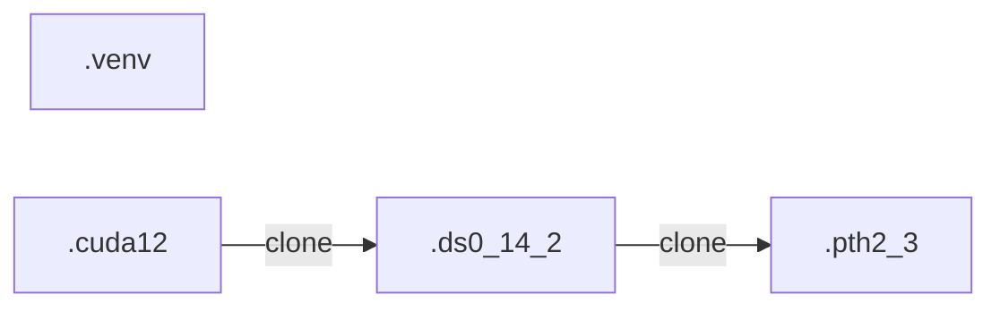

# Conda環境整備注意点

## Conda環境の作成と経緯

- リポジトリ内のdocs/tools/install.mdの手順に従ってインストールしてください。
- ドキュメント未記入ですが、`install_12.1.sh`も存在しており、こちらはCUDA12.1となっています。
  - このスクリプトは既に`miniconda3`がインストールされていることを前提としています。
  - ただ、実際には当時は手動でインストールを行い、スクリプトを実行はしていません。
- その後、CUDA12.1の環境を複製しDeepSpeed 0.14.2を手動でインストールしています。
- またその後、DeepSpeed 0.14.2 1を複製し、PyTorch2.3を手動でインストールしています。

| 環境名    | CUDA | PyTorch | DeepSpeed | 備考                                      |
| --------- | ---- | ------- | --------- | ----------------------------------------- |
| .venv     | 11.8 | 2.2     | 0.12.4    | install.shでインストール                  |
| .cuda12   | 12.1 | 2.2     | 0.12.4    | 手動でインストール                        |
| .ds0_14_2 | 12.1 | 2.2     | 0.14.2    | 手動でインストール                        |
| .pth2_3   | 12.1 | 2.3     | 0.14.2    | 手動でインストール。GPUなしでセットアップ |

### 環境継承図



## 環境の複製方法

- 計算ノードで実行してください。

```bash
conda create -n (環境名) --clone (複製元環境名)
```

### その他修正点

- `miniconda3/envs/(環境名)/etc/conda/activate.d/edit_environment_vairable.sh`の編集
  - 複製元の環境名がスクリプト内に記載されているので、複製先の環境名に修正してください。

## DeepSpeed 0.14.2のインストール

- 以下は、DeepSpeed 0.12.4のインストール時のコマンドですが、＋αの設定が必要。（ドキュメント化し忘れ。エラーメッセージに従って対応すればできた）
```bash
DS_BUILD_OPS=1 DS_BUILD_EVOFORMER_ATTN=0 DS_BUILD_SPARSE_ATTN=0 pip install deepspeed==0.12.4
```

- その後、MegatronDeepSpeedのインストールなども再実行。（手順の通りに再実行を実施。ただ、以下を実施すれば、この手順は不要かも？）
- `GENIAC_haijima/train/Megatron-DeepSpeed/megatron/fused_kernels/build/` の下を削除。

## PyTorch2.3のインストール

- GPUなしでセットアップしたため、CPU版がインストールされています！！

```bash
conda install pytorch=2.3 torchvision torchaudio pytorch-cuda=12.1 -c pytorch -c nvidia -y
```

```
The following packages will be downloaded:

    package                    |            build
    ---------------------------|-----------------
    pytorch-2.3.0              |     py3.11_cpu_0        85.6 MB  pytorch
    pytorch-mutex-1.0          |              cpu           3 KB  pytorch
    torchaudio-2.3.0           |        py311_cpu         5.1 MB  pytorch
    torchvision-0.18.0         |        py311_cpu         7.0 MB  pytorch
    ------------------------------------------------------------
```

```
(.pth2_3) ext_mutomob_gmail_com@slurm0-a3-ghpc-6:/storage3$ python
Python 3.11.9 (main, Apr 19 2024, 16:48:06) [GCC 11.2.0] on linux
Type "help", "copyright", "credits" or "license" for more information.
>>> import torch
>>> torch.__version__
'2.3.0'
>>> torch.cuda.is_available()
False
```

### その他修正点

- intel-extension-for-pytorchのインストール

```bash
pip install intel-extension-for-pytorch
```

```
(.pth2_3) ext_mutomob_gmail_com@slurm0-a3-ghpc-6:/storage3$ python
Python 3.11.9 (main, Apr 19 2024, 16:48:06) [GCC 11.2.0] on linux
Type "help", "copyright", "credits" or "license" for more information.
>>> import torch
>>> import intel_extension_for_pytorch as ipex
[2024-05-22 07:06:33,181] [INFO] [real_accelerator.py:203:get_accelerator] Setting ds_accelerator to cpu (auto detect)
Warning: The default cache directory for DeepSpeed Triton autotune, /home/ext_mutomob_gmail_com/.triton/autotune, appears to be on an NFS system. While this is generally acceptable, if you experience slowdowns or hanging when DeepSpeed exits, it is recommended to set the TRITON_CACHE_DIR environment variable to a non-NFS path.
```
